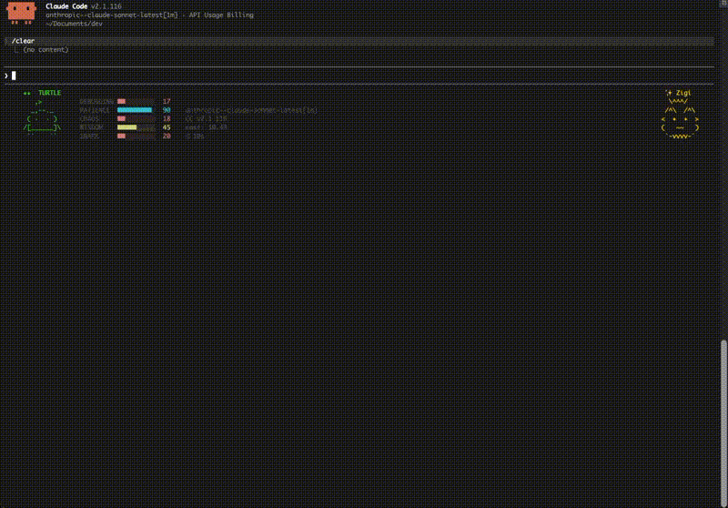
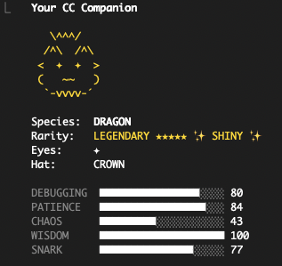

# CC Companion

> Your coding buddy pet for Claude Code — alive in your statusline while you work.

[](https://github.com/zigizhujian/cc-companion)
[](LICENSE)
[](https://claude.ai/code)
[](#installation)
[](#why-a-plugin-not-mcp)



**Anthropic removed `/buddy` in Claude Code v2.1.97.** CC Companion brings it back as a native plugin — no MCP server overhead, no background processes. Just skills, hooks, and shell scripts.

Beyond the classic **sprite mode** with speech bubbles and pet hearts, CC Companion offers **hud mode** with full stats and session info, a **screensaver** that parades random pets like opening blind boxes, and the all-in-one **combined mode** that brings your statusline to life with a rotating pet show on the left and your faithful companion on the right.

---

### Why a Plugin, Not MCP?

Similar tools use MCP servers with 17+ tool schemas — all loaded into every single message, burning tokens even when idle. CC Companion takes a different approach:

- **Skills** — load only when you invoke them. Zero cost when not in use.
- **Hooks** — lightweight shell scripts, no server process.
- **Statusline** — a simple Bun script, no daemon.

No background processes. No idle token overhead. Just a plugin that works.

---

## Installation

```
/plugin marketplace add zigizhujian/cc-companion
/plugin install cc-companion
```

**Requires [Bun](https://bun.sh)** — Currently, only user-level installation is supported. Project-level installation will not work correctly.

---

## Commands

| Command | Description |
|---------|-------------|
| `/cc-companion:companion` | Show your companion (ASCII art, stats, rarity) |
| `/cc-companion:companion-customize` | Choose your own species, rarity, eyes, hat |
| `/cc-companion:companion-statusline` | Toggle companion statusline on/off |
| `/cc-companion:companion-pet` | Pet your companion |
| `/cc-companion:companion-collection` | Save, list, switch, or remove favorite pets |
| `/cc-companion:companion-screensaver` | Toggle screensaver mode on/off |

---

## Your Companion

Run `/cc-companion:companion` to see your pet — species, rarity, eyes, hat, and stats. On first use it will ask you to give your companion a name.



---

## Customization

`/cc-companion:companion-customize` walks you through choosing species, rarity, eyes, hat, and shiny. The plugin brute-force searches for a matching salt using `Bun.hash` — usually under 2 seconds.

Once you have a pet you like, save it to your collection with `/cc-companion:companion-collection`.

---

## Display Modes

Run `/cc-companion:companion-statusline` to enable the statusline. Then set `displayMode` in `~/.claude/plugins/cc-companion/config.json`.

### `"sprite"` — minimal right-aligned pet (animated sprite or screensaver pet)

Your companion tucked in the corner with name above. Closest to the original CC buddy UI.


### `"hud"` — animated sprite or screensaver pet + stats + session info


### `"combined"` — screensaver pet (random or collection) on the left, your pet on the right, both animated


---

## Pet

Run `/cc-companion:companion-pet` to pet your companion. Floating hearts appear for a few seconds. Works on the right-side sprite in `combined` and `sprite` modes.


---

## Speech Bubble

Your companion reacts to each conversation turn with a short comment in a speech bubble next to the sprite. The bubble appears for 10 seconds with a fade-out effect.

Toggle via `/cc-companion:companion-statusline` → "Toggle speech bubble", or set `speechBubble` in config. Default off — when on, costs a few extra tokens per turn.

Works in `sprite` and `combined` modes. Bubble language follows the user's language.


---

## Collection

Save your favorite pets and switch between them anytime.

Run `/cc-companion:companion-collection`: **save** · **list** · **switch** · **remove**

---

## Screensaver

Turn your statusline into a **pet parade** — a new companion appears periodically, like opening blind boxes while you code.

Run `/cc-companion:companion-screensaver` to toggle. Choose a refresh interval:
- **0** — new pet on every statusline refresh
- **1** — new pet every minute
- **5** (default) — new pet every 5 minutes

Set `screensaverMode` to `"random"` for fully random pets, or `"collection"` to cycle through your saved favorites.

---

## Reference

### Species

18 unique species, each with 3-frame animation:

```
DUCK          GOOSE         BLOB          CAT           DRAGON        OCTOPUS
                                                                              
    __             (·>         .----.        /\_/\        /^\  /^\       .----.
  <(· )___         ||         ( ·  · )      ( ·   ·)     <  ·  ·  >     ( ·  · )
   (  ._>        _(__)_       (      )      (  ω  )      (   ~~   )     (______)
    `--´          ^^^^         `----´       (")_(")       `-vvvv-´      /\/\/\/\

OWL           PENGUIN       TURTLE        SNAIL         GHOST         AXOLOTL
                                                                              
   /\  /\       .---.          _,--._      ·    .--.       .----.     }~(______)~{
  ((·)(·))      (·>·)         ( ·  · )      \  ( @ )      / ·  · \    }~(· .. ·)~{
  (  ><  )     /(   )\       /[______]\      \_`--´       |      |      ( .--. )
   `----´       `---´         ``    ``      ~~~~~~~       ~`~``~`~      (_/  \_)

CAPYBARA      CACTUS        ROBOT         RABBIT        MUSHROOM      CHONK
                                                                              
  n______n     n  ____  n      .[||].        (\__/)      .-o-OO-o-.     /\    /\
 ( ·    · )    | |·  ·| |     [ ·  · ]      ( ·  · )    (__________)   ( ·    · )
 (   oo   )    |_|    |_|     [ ==== ]     =(  ..  )=      |·  ·|      (   ..   )
  `------´       |    |       `------´      (")__(")       |____|       `------´
```

### Hats

Available for uncommon and above:

```
CROWN      TOPHAT     PROPELLER  HALO       WIZARD     BEANIE     TINYDUCK
 \^^^/       [___]       -+-      (   )       /^\        (___)       ,>
```

### Rarity

| Rarity    | Stars | Chance | Hat? | Shiny? |
|-----------|-------|--------|------|--------|
| Common    | ★     | 60%    | —    | 1%     |
| Uncommon  | ★★    | 25%    | Yes  | 1%     |
| Rare      | ★★★   | 10%    | Yes  | 1%     |
| Epic      | ★★★★  | 4%     | Yes  | 1%     |
| Legendary | ★★★★★ | 1%     | Yes  | 1%     |

**Shiny** — 1% chance on top of rarity. Marked with ✨ in the statusline. Any rarity can be shiny.

### Stats

DEBUGGING · PATIENCE · CHAOS · WISDOM · SNARK

Stat bars are colored: **cyan** (high) · **yellow** (mid) · **red** (low)

### How It Works

`Bun.hash(userId + salt)` feeds a Mulberry32 PRNG that picks species, rarity, eyes, hat, and stats. Customization finds an alternative 15-character salt that produces your desired traits — no binary patching required.

Config: `~/.claude/plugins/cc-companion/config.json`

---

## License

MIT
